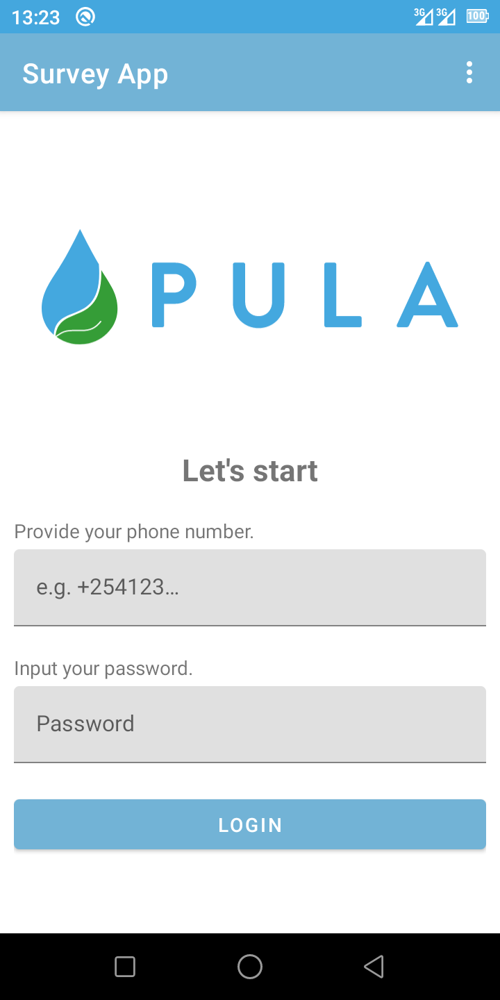
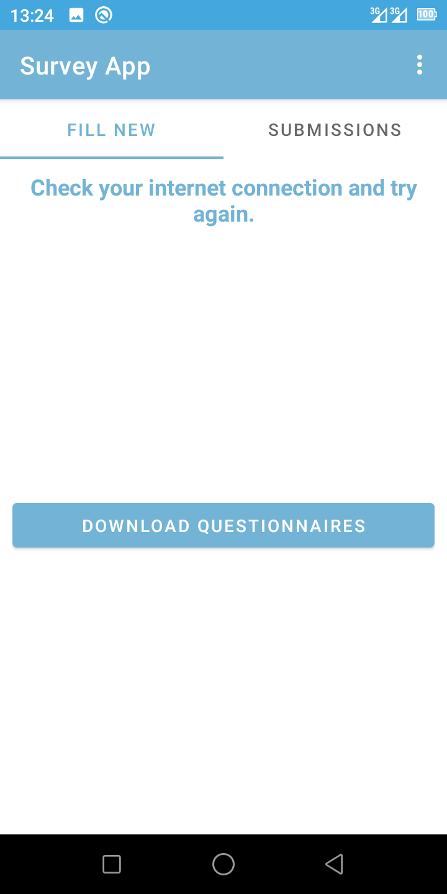
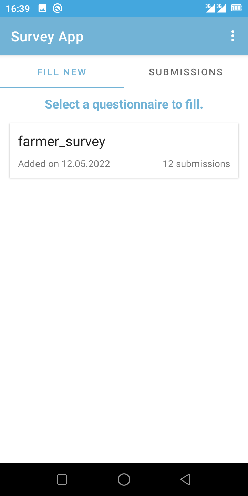
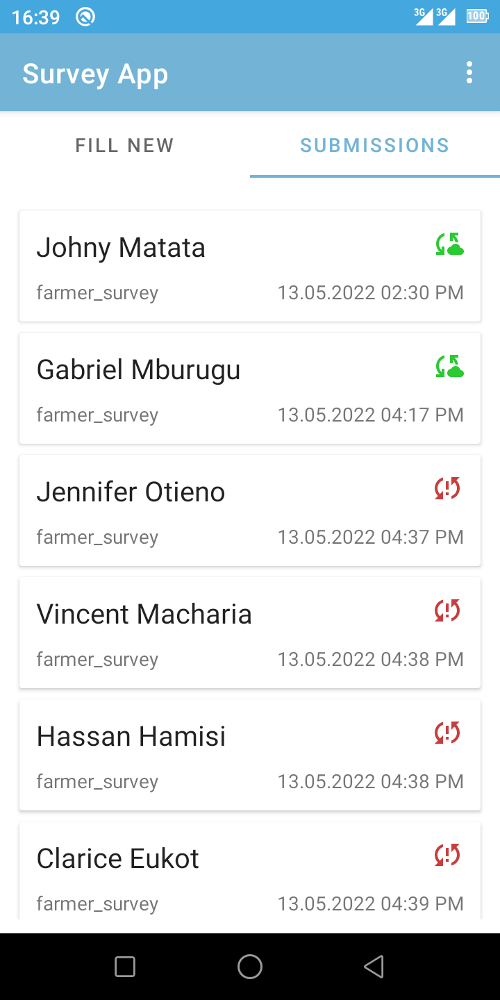
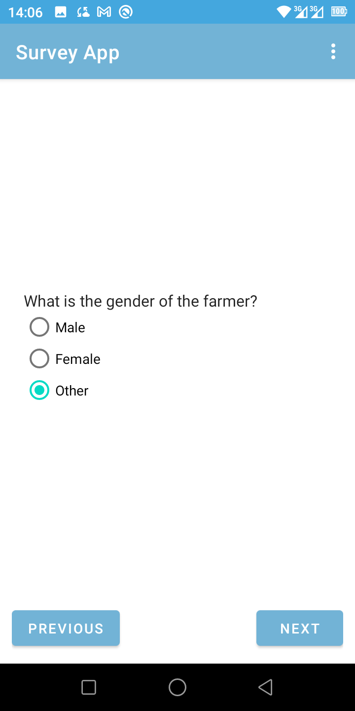
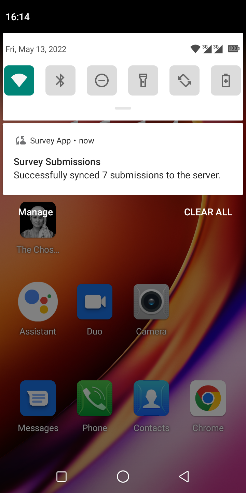

# Survey App

A simple app to do the following:
 - Allow user to log in
 - Download questionnaires(will be used interchangeably with surveys) from server
 - Select a questionnaire and fill
 - Syncs the responses every 15 minutes when network is available.

## To Run
 Here's how to run:
 1. Clone the repo from your editor(Android Studio/ IntelliJ)
    1. `File` -> `New` -> `Project From Version Control`
    2. Input `git@github.com:keronei/survey-app.git` if you have set up `SSH` 
    or `https://github.com/keronei/survey-app.git` if you prefer https(not recommended).
 2. Once complete, it will ask if to trust project, Go ahead and Trust its execution.
 3. No special keys/dependencies, let it sync, then connect a device and run.
 4. Use a phone number with +254xxxxxxxxx and password 1234GYD%$

Let's assume laziness got you unexpectedly, you can try this [debug apk](https://link to apk)(might not be up-to-date).

## Approach

The approach of this app is as follows;
1. Downloads the `json` file containing question definitions.
2. Parses the questionnaires into `QuestionnaireDef` and questions to `QuestionDef`
3. The widgets for various input types are predefined already e.g. `FloatWidget`, you can find this
in app/com.keronei.survey/presentation/ui/views/widgets, which inherits from an abstract Class called `QuestionWidget`
which defines most of the common functions like `saveAnswer`, `createAnswerView`, `getAnswerView`, `setupQuestionLabel` e.t.c.
4. When a user selects a questionnaire to fill, a singleton class `QuestionnaireController` is given the questionnaire to 
process and provide easy access to questions by offering functions such as `getNextQuestion`, `getPreviousQuestion`, `getCurrentEvent`
which returns events like `EVENT_BEGGINING_QUESTIONNAIRE`, `EVENT_QUESTION`, `EVENT_END_QUESTIONNAIRE` which is useful
in determining how to guide the user in providing responses.
5. When the controller returns a question, a `WidgetFactory` class accepts a `QuestionDef` and returns a widget representing 
the question, which can be added to the view.
6. This approach enables re-usability of widgets and robustness in handling questionnaires.

## Display
Here are some screens to expect.

  
  

The data is from the [https://run.mocky.io](https://run.mocky.io/v3/d628facc-ec18-431d-a8fc-9c096e00709a).

Feel free to contribute to this project, and remember to follow the prerequisites as you work on the code.

### Prerequisites

Before every commit, make sure you run the following command:

```shell script
./codeAnalysis
```

To check for dependency updates, run the following command:

```shell script
./gradlew dependencyUpdate
```

Refer to this [issue](https://github.com/gradle/gradle/issues/10248), if you get any issues running the lint commands on the terminal :rocket:

## Tech-stack

* Gradle
    * [Gradle Kotlin DSL](https://docs.gradle.org/current/userguide/kotlin_dsl.html) - For reference purposes, here's an [article explaining the migration](https://medium.com/@evanschepsiror/migrating-to-kotlin-dsl-4ee0d6d5c977).
    * Plugins
        * [Ktlint](https://github.com/JLLeitschuh/ktlint-gradle) - creates convenient tasks in your Gradle project that run ktlint checks or do code auto format.
        * [Detekt](https://github.com/detekt/detekt) - a static code analysis tool for the Kotlin programming language.
        * [Spotless](https://github.com/diffplug/spotless) - format java, groovy, markdown and license headers using gradle.
        * [Dokka](https://github.com/Kotlin/dokka) - a documentation engine for Kotlin, performing the same function as javadoc for Java.
        * [jacoco](https://github.com/jacoco/jacoco) - a Code Coverage Library.
        * [Gradle Versions](https://github.com/ben-manes/gradle-versions-plugin) - provides a task to determine which dependencies have updates. Additionally, the plugin checks for updates to Gradle itself.
        
For reference, here's a detailed explanation of the approach of the plugin configuration in this project - [A Day with an Elephant in the Room: Configuring Gradle Plugins.](https://medium.com/@harunwangereka/a-day-with-an-elephant-in-the-room-configuring-gradle-plugins-3331b0be64c7)
